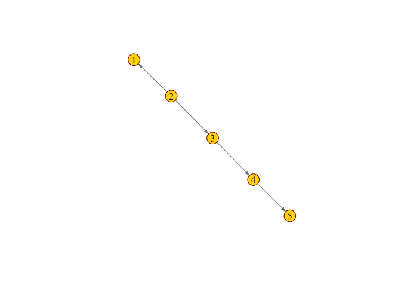

<!-- README.md is generated from README.Rmd. Please edit that file -->

# causnet

<!-- badges: start -->

[](https://travis-ci.org/USCbiostats/causnet)
[](https://codecov.io/gh/USCbiostats/causnet?branch=master)
<!-- badges: end -->

The goal of causnet is to …

## Installation

You can install the development version from GitHub with:

``` r
require("devtools")
install_github("USCbiostats/causnet")
```

\~You can install the released version of causnet from
[CRAN](https://CRAN.R-project.org) with:\~

``` r
install.packages("causnet")
```

## Example

``` r
library(causnet)

# simulate data
set.seed(1234)
mydata = simdat(n.var = 5)

# causnet results
links.s = sfun(mydata)

links.s
#>   from to component
#> 1    4  5         1
#> 2    3  4         1
#> 3    2  1         1
#> 4    2  3         1

netplot_jm(links.s)
```


